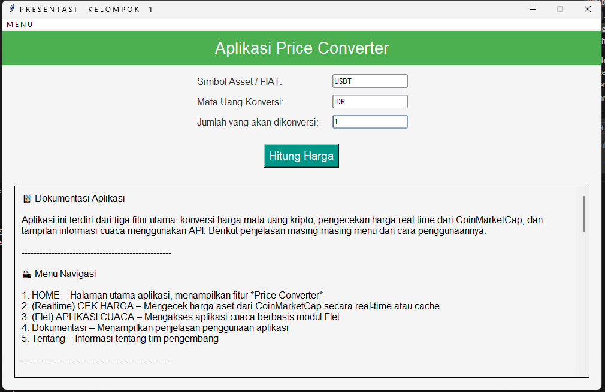
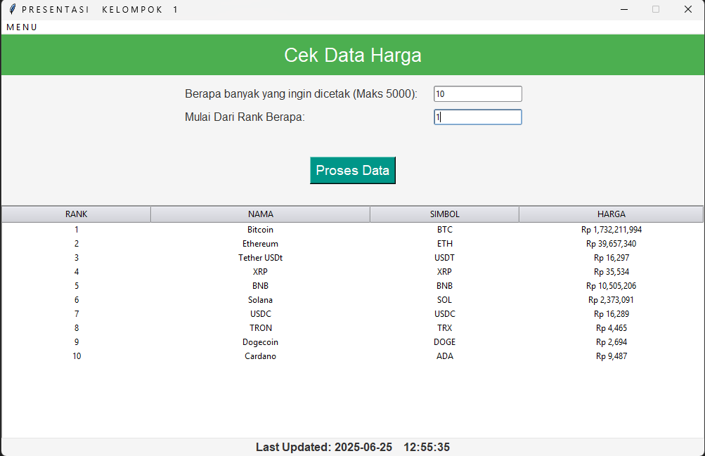
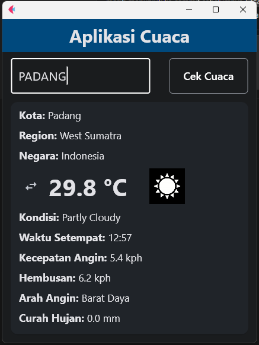
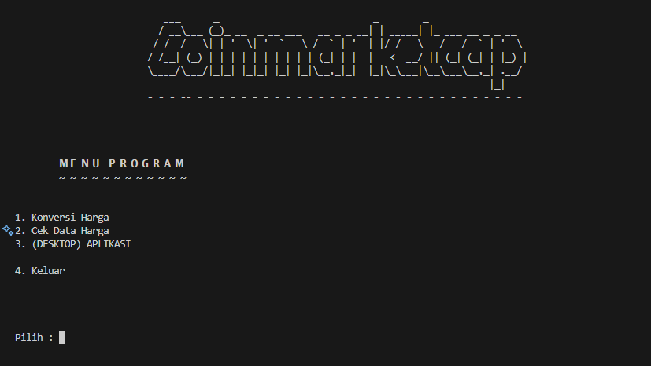

# 🪙 SuperApps: Crypto & Weather Dashboard – Python + Flet

**SuperApps** adalah aplikasi desktop interaktif berbasis Python yang memadukan informasi cuaca dan data cryptocurrency secara real-time.

🔹 **Fitur Utama:**

* 🔄 Konversi harga kripto (CoinMarketCap)
* 📈 Pemantauan harga aset kripto real-time
* 🌦️ Tampilan cuaca real-time (WeatherAPI + Flet)

Dikembangkan untuk kebutuhan data dinamis, monitoring, dan eksplorasi API secara praktis.

---

## 🚀 Fitur Lengkap

| Fitur                    | Deskripsi                                                                    |
| ------------------------ | ---------------------------------------------------------------------------- |
| 🔄 Konversi Harga Kripto | Ubah BTC, ETH, dan lainnya ke IDR/USD dengan nilai aktual dari CoinMarketCap |
| 📈 Cek Harga Kripto      | Lihat daftar hingga 5000 aset berdasarkan peringkat                          |
| 🌦️ Info Cuaca           | Ambil kondisi cuaca berdasarkan kota dan tampilkan secara GUI (Flet)         |
| 📚 Dokumentasi Visual    | Tampilkan flowchart, markdown, dan dokumentasi proyek secara interaktif      |

---

## 📁 Struktur Folder

```
SuperApps/
├── Prototype/                 # Versi CLI & modul logika
│   ├── list_fungsi.py        # Fungsi konversi, API, dan cache
│   ├── presentasi.py         # CLI program
│   ├── cuaca.py              # Aplikasi cuaca dengan Flet
│   └── cache.json            # Simpan data sementara
├── asset/                    # Gambar & dokumentasi visual
│   ├── price_converter.png
│   ├── price_checker.png
│   ├── cuaca.png
│   ├── cli.png
│   └── docs/
│       ├── about.md
│       ├── doc.md
│       └── flowchart.md
├── main.py                   # GUI SuperApps utama
├── apikey.json               # Simpan API key (jangan upload publik)
├── requirements.txt
├── README.md
└── .gitignore
```

---

## 🧭 Navigasi Aplikasi

### 🔹 CLI Mode

```bash
1. Konversi Harga
2. Cek Data Harga
3. (DESKTOP) APLIKASI
4. Keluar
```

### 🔹 GUI Mode

Menu utama:

* HOME
* Harga Real-time
* Aplikasi Cuaca
* Dokumentasi / Flowchart
* Tentang
* Keluar

---

## ⚙️ Instalasi & Setup

```bash
# (Opsional) Virtual environment
python -m venv env
env\Scripts\activate

# Install dependencies
pip install -r requirements.txt
```

**Dependencies:**

```
requests
flet
ttkthemes
screeninfo
```

---

## 🔐 Konfigurasi API Key

Buat file `apikey.json` di direktori utama dengan isi:

```json
{
  "weather": "API_KEY_WEATHERAPI_ANDA",
  "coinmarketcap": "API_KEY_COINMARKETCAP_ANDA"
}
```

> File ini bersifat rahasia dan dikecualikan dari version control.

---

## 🔗 Endpoint API

### 🪙 CoinMarketCap

* `/v1/tools/price-conversion`
* `/v1/cryptocurrency/map`

### 🌤️ WeatherAPI

* `/v1/current.json?key=API_KEY&q={KOTA}&lang=id`

---

## 🖼️ Cuplikan Aplikasi

| Modul           | Cuplikan                                      |
| --------------- | --------------------------------------------- |
| Konversi Harga  |  |
| Harga Kripto    |      |
| Cuaca Real-time |                      |
| CLI Interface   |                          |

---

## 🧪 Panduan Penggunaan

### 🔄 Konversi Harga

* Masukkan: Simbol koin (e.g. BTC), mata uang tujuan (e.g. IDR), jumlah
* Hasil: Konversi harga real-time

### 📈 Harga Kripto

* Input: Jumlah data, peringkat awal
* Output: Tabel harga dan simbol aset

### 🌦️ Aplikasi Cuaca

* Input: Nama kota
* Output: Detail cuaca, ikon, suhu, angin (dalam bahasa Indonesia)

### 📚 Dokumentasi

* Markdown interaktif & flowchart dapat dibuka dari aplikasi

---

## ⚠️ Disclaimer

Aplikasi ini dibuat untuk kebutuhan edukasi dan eksperimen integrasi API. Gunakan dengan bijak dan tidak untuk komersial.

---

*Dibuat dengan ❤️ oleh: **Ahmad Nur Ikhsan***